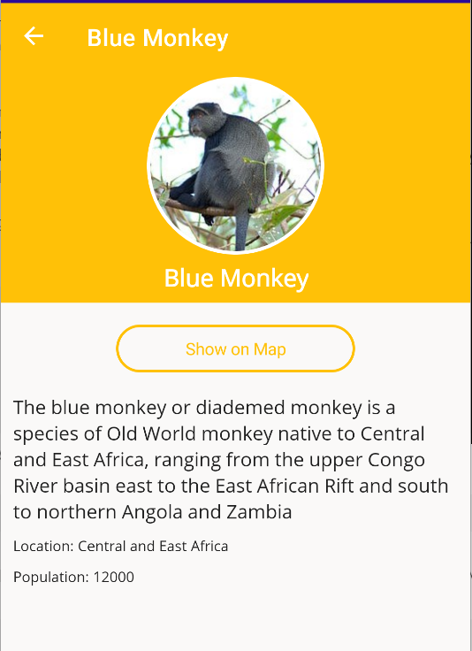

## 实验三: 添加导航页面

在实验三中，我们将添加简单的导航以将新页面推送到堆栈中以显示有关猴子的详细信息。

我们将使用 .NET MAUI 的内置 Shell 导航。 这个强大的导航系统基于 URI。 您可以在导航查询参数（例如字符串或完整对象）时传递其他信息。

例如，假设我们想要导航到详细信息页面并传入一个标识符。

```csharp
await Shell.Current.GoToAsync("DetailsPage?name=james");
```

然后在我们的详细信息页面或视图模型中，我们应该定义这个属性：

```csharp
[QueryProperty(nameof(Name), "name")]
public partial class DetailsPage : ContentPage
{
    string name;
    public string Name
    {
        get => name;
        set => name = value;
    }
}
```

当我们导航时，名称“james”会自动传递。 我们也可以使用相同的机制传递一个完整的对象：

```csharp
var person = new Person { Name="James" };
await Shell.Current.GoToAsync("DetailsPage", new Dictionary<string, object>
{
    { "person", person }
});
```

然后在我们的页面或视图模型上，我们将创建该属性。

```csharp
[QueryProperty(nameof(Person), "person")]
public partial class DetailsPage : ContentPage
{
    Person person;
    public Person Person
    {
        get => person;
        set => person = value;
    }
}
```

在这里，当我们导航时，`Person` 会自动为我们序列化和反序列化。

现在，让我们向集合视图添加一个点击处理程序并将猴子传递到详细信息页面。

### 添加选定的事件

现在，让我们将导航添加到显示猴子详细信息的第二个页面！

1. 在`MonkeysViewModel.cs`中，创建一个方法`async Task GoToDetailsAsync(Monkey monkey)`，暴露为`[RelayCommand]`：

    ```csharp
    [RelayCommand]
    async Task GoToDetails(Monkey monkey)
    {
        if (monkey == null)
	    return;

        await Shell.Current.GoToAsync(nameof(DetailsPage), true, new Dictionary<string, object>
        {
            {"Monkey", monkey }
        });
    }
    ```

    - 此代码检查所选项目是否为非空，并使用内置的 Shell `Navigation` API 以猴子为参数推送新页面，然后取消选择该项目。

2. 在 `MainPage.xaml` 中，我们可以在 `CollectionView.ItemTemplate` 内的猴子的 `Border` 中添加 `TapGestureRecognizer` 事件：

    之前:

    ```xml
    <CollectionView.ItemTemplate>
        <DataTemplate x:DataType="model:Monkey">
            <Grid Padding="10">
                <Border HeightRequest="125" Style="{StaticResource CardView}">
                    <Grid Padding="0" ColumnDefinitions="125,*">
                        <Image
                            Aspect="AspectFill"
                            HeightRequest="125"
                            Source="{Binding Image}"
                            WidthRequest="125" />
                        <VerticalStackLayout
                            Grid.Column="1"
                            VerticalOptions="Center"
                            Padding="10">
                            <Label Style="{StaticResource LargeLabel}" Text="{Binding Name}" />
                            <Label Style="{StaticResource MediumLabel}" Text="{Binding Location}" />
                        </VerticalStackLayout>
                    </Grid>
                </Border>
            </Grid>
        </DataTemplate>
    </CollectionView.ItemTemplate>
    ```

    之后:
    ```xml
    <CollectionView.ItemTemplate>
        <DataTemplate x:DataType="model:Monkey">
            <Grid Padding="10">
                <Border HeightRequest="125" Style="{StaticResource CardView}">
                    <!-- Add the Gesture Recognizer-->
                    <Border.GestureRecognizers>
                        <TapGestureRecognizer 
                                Command="{Binding Source={RelativeSource AncestorType={x:Type viewmodel:MonkeysViewModel}}, x:DataType=viewmodel:MonkeysViewModel, Path=GoToDetailsCommand}"
                                CommandParameter="{Binding .}"/>
                    </Border.GestureRecognizers>
                    <Grid Padding="0" ColumnDefinitions="125,*">
                        <Image
                            Aspect="AspectFill"
                            HeightRequest="125"
                            Source="{Binding Image}"
                            WidthRequest="125" />
                        <VerticalStackLayout
                            Grid.Column="1"
                            VerticalOptions="Center"
                            Padding="10">
                            <Label Style="{StaticResource LargeLabel}" Text="{Binding Name}" />
                            <Label Style="{StaticResource MediumLabel}" Text="{Binding Location}" />
                        </VerticalStackLayout>
                    </Grid>
                </Border>
            </Grid>
        </DataTemplate>
    </CollectionView.ItemTemplate>
    ```

    这使用了 `RelativeSource` 绑定，这意味着它不再绑定到 `DataTemplate` 中的 `Monkey`，而是专门为 `MonkeysViewModel` 的 `AncestorType` 查找层次结构。 这允许像这样的更高级的场景。

### 为详细信息页面添加新的 ViewModel 

1. 在您的“ViewModel/Monkey Details ViewModel.cs”中，我们将包含将猴子分配给视图模型的逻辑。 让我们首先为“Monkey”创建一个可绑定属性：

    ```csharp
    public partial class MonkeyDetailsViewModel : BaseViewModel
    {
        public MonkeyDetailsViewModel()
        {
        }

        [ObservableProperty]
        Monkey monkey;    
    }
    ```

2. 接下来，我们将添加一个 `QueryProperty` 来处理传递猴子数据：

    ```csharp
    //Add QueryProperty
    [QueryProperty(nameof(Monkey), "Monkey")]
    public partial class MonkeyDetailsViewModel : BaseViewModel
    {
        public MonkeyDetailsViewModel()
        {
        }

        [ObservableProperty]
        Monkey monkey;
    }
    ```

## 注册页面路由

现在我们已经有了详细信息页面，我们需要注册它以进行路由。 这是在 Shell 路由系统和 .NET MAUI 依赖项服务中完成的。

1、打开后面的`AppShell.xaml.cs`代码，在`InitializeComponent();`调用下的构造函数中加入如下代码：

    ```csharp
    Routing.RegisterRoute(nameof(DetailsPage), typeof(DetailsPage));
    ```
    这将使用我们之前使用的“DetailsPage”路由注册详细信息页面。

2. 打开“MauiProgram.cs”并将视图模型和页面都添加为“Transient”，这样每次导航到时都会创建一个新的页面和视图模型：

    ```csharp
    builder.Services.AddTransient<MonkeyDetailsViewModel>();
    
    ```

> Starting in .NET 9 you no longer need to register Pages with the dependency service for constructor injection to work. By default when we navigate to a new page it will be created an the `MonkeyDetailsViewModel` will be injected as well.

3. 最后，我们必须将视图模型注入到我们的 `DetailsPage` 中。 在 `DetailsPage.xaml.cs` 中打开页面背后的代码，并将构造函数更改为以下内容：

    ```csharp
	public DetailsPage(MonkeyDetailsViewModel viewModel)
	{
		InitializeComponent();
		BindingContext = viewModel;
	}
    ```

### 为 DetailsPage.xaml 创建 UI

让我们将 UI 添加到 DetailsPage。 我们的最终目标是获得这样一个精美的详细资料展示的界面：



1. 首先通过定义视图模型的命名空间并设置标题来定义我们的 DataType：

    ```xml
    <ContentPage
        xmlns="http://schemas.microsoft.com/dotnet/2021/maui"
        xmlns:x="http://schemas.microsoft.com/winfx/2009/xaml"
        x:Class="MonkeyFinder.DetailsPage"
        xmlns:viewmodel="clr-namespace:MonkeyFinder.ViewModel"
        x:DataType="viewmodel:MonkeyDetailsViewModel"
        Title="{Binding Monkey.Name}">

        <!-- Add Content Here -->
    </ContentPage>
    ```

2. 核心是 `ScrollView` 和 `Grid` 在屏幕上很好地布局所有控件：

    ```xml
    <ScrollView>
        <Grid RowDefinitions="Auto,Auto,*">

            <!-- Background, Image of Monkey, Name -->
        
            <!-- Details of Monkey -->

        </Grid>
    </ScrollView>
    ```

3. 我们现在可以用下面的代码填充我们的`Grid`，放置一个 box 作为黄色背景色，然后我们的猴子图像被剪成一个圆形：


    ```xml
    <BoxView
        BackgroundColor="{StaticResource Primary}"
        Grid.RowSpan="2"
        HorizontalOptions="Fill"
        VerticalOptions="Fill"/>

    <Border StrokeShape="RoundRectangle 80"
            Stroke="White"
            StrokeThickness="6"
            HeightRequest="172"
            WidthRequest="172"
            Margin="0,8,0,0"
            HorizontalOptions="Center"
            VerticalOptions="Center">
            <Image Aspect="AspectFill"
                HeightRequest="160"
                HorizontalOptions="Center"
                VerticalOptions="Center"
                Source="{Binding Monkey.Image}"
                WidthRequest="160"/>
    </Border>

    <Label Style="{StaticResource LargeLabel}" 
            Grid.Row="1"
            TextColor="White"
            FontAttributes="Bold"
            Text="{Binding Monkey.Name}" 
            HorizontalOptions="Center"
            Margin="0,0,0,8"/>
    ```

4. 最后，在 `Grid` 下，在 `VerticalStackLayout` 内部，我们将添加有关猴子的详细信息。
   

```xml
<VerticalStackLayout Grid.Row="2" Padding="10" Spacing="10">
    <Label Style="{StaticResource MediumLabel}" Text="{Binding Monkey.Details}" />
    <Label Style="{StaticResource SmallLabel}" Text="{Binding Monkey.Location, StringFormat='Location: {0}'}" />
    <Label Style="{StaticResource SmallLabel}" Text="{Binding Monkey.Population, StringFormat='Population: {0}'}" />
</VerticalStackLayout>
```

5. 在所需平台上运行应用程序并点击一只猴子进行导航跳转！

平台特性是我们接下来要探索的话题。 导航到 [实验四: 访问平台特性](../Part%204%20-%20Platform%20Features/README.zh-cn.md) 以开始下一个实验。
   
